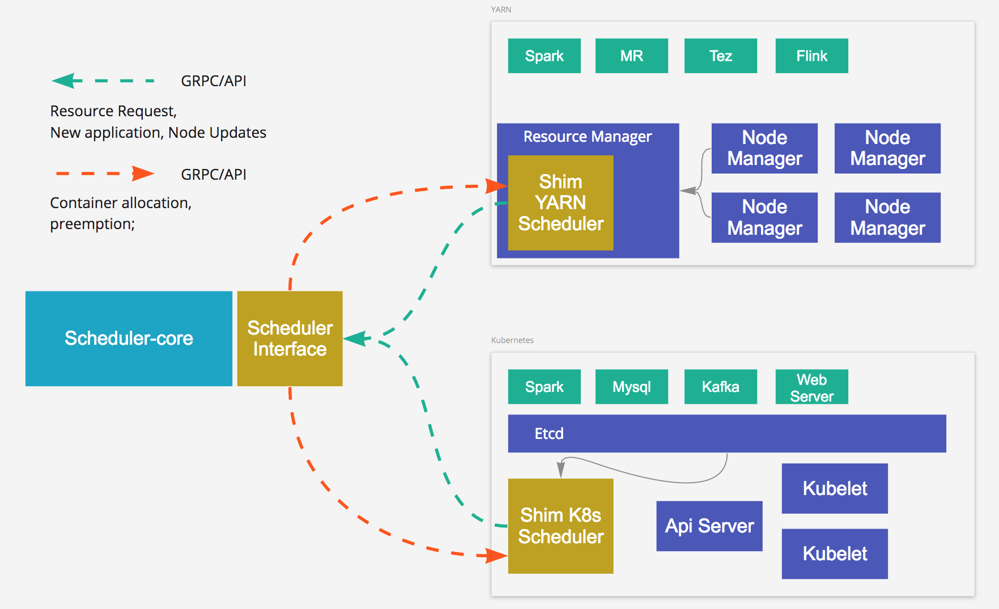

# YuniKorn - The Universal Scheduler

## Why this name

- The Universal Scheduler for both YARN and Kubernetes
- Y for YARN, uni for “unity scheduler”, K for Kubernetes.
- Pronunciation: `['ju:nikɔ:n]` same as Unicorn

## Motivations

Scheduler of a container orchestration system, such as YARN and Kubernetes, is a critical component that users rely on to plan resources and manage applications. They have different characters to support different workloads:

YARN schedulers are optimized for high-throughput, multi-tenant batch workloads. It can scale up to 50k nodes per cluster, and schedule 20k containers per second; On the other side, Kubernetes schedulers are optimized for long-running services, but many features like hierarchical queues to support multi-tenancy better, fairness resource sharing, and preemption etc, are either missing or not mature enough at this point of time.

However, underneath they are responsible for one same job: the decision maker for resource allocations. We see the need to run services on YARN as well as run jobs on Kubernetes. This motivates us to create a universal scheduler which can work for both YARN and Kubernetes, configured in the same way. And we can maintain the same source code repo in the future.

YuniKorn is a generic container scheduler system to help run jobs and deploy services for cloud-native and on-prem use cases at scale. In addition, users will easily deploy YuniKorn easily on Kubernetes via Helm/Daemonset.

## What is YuniKorn

The new scheduler just externerize scheduler implementation of YARN and K8s.

- Provide a scheduler-interface, which is common scheduling API.
- Shim-scheduler binding inside YARN/Kubernetes to translate resource requests to scheduler-interface request.
- Applications on YARN/K8s can use the scheduler w/o modification. Because there’s no change of application protocols.

YuniKorn can run either inside shim scheduler process (by using API) or outside of shim scheduler process (by using GRPC)

### What is NOT YuniKorn

Following are NOT purpose of YuniKorn
- Be able to run your YARN application (Like Apache Hadoop Mapreduce) on K8s. (Or vice-versa)

## Key features

Here are some key features of YuniKorn. (Planned)

- Works across YARN and K8s initially, can add support to other resource management platforms when needed.
- Multi-tenant use cases
  + Fairness between queues.
  + Fairness between apps within queues. 
  + Guaranteed quotas, maximum quotas for queues/users.
- Preemption
  + (Queue/user) quota-based preemption. 
  + Application-priority-based preemption.
  + Honor Disruption Budgets?
- Customized resource types scheduling support. (Like GPU, disk, etc.)
- Rich placement constraints support.
  + Affinity / Anti-affinity for node / containers.
  + Cardinality. 
- Automatically map incoming requests to queues by policies. 
- Works for both short-lived/long-lived batch jobs and services.
- Serve requests with high volumes. (Targeted to 10k container allocations per second on a cluster with 10k+ nodes).

## Components

YuniKorn consists of the following components:
- Scheduler interface: API layer (with GRPC/programming language bindings) which is agnostic to resource management platform like YARN/K8s. 
- Scheduler core: the brain of the scheduler, which makes placement decisions (Allocate container X on node Y) according to pre configured policies.
- Resource Manager shims: Built-in support to allow YARN/K8s talks to scheduler interface. Which can be configured on existing clusters without code change.

## Github Repos

- Scheduler Interface:
  + Link: https://github.infra.cloudera.com/yunikorn/scheduler-interface
  + Purpose: Define the common scheduler interface.
- Scheduler Shims:
  + k8s-shim: https://github.infra.cloudera.com/yunikorn/k8s-shim
- Scheduler UI
  + Link: 

## How to build

Prerequisite: 
- Go 1.11+

Steps: 
- Run `dep ensure -update` to update dependencies
- TODO: What we need to do? (weiwei/sunil)

## How to use 

The simplest way to run YuniKorn is to leverage our pre-built docker images.
YuniKorn could be easily deployed to Kubernetes with a yaml file, running as a customized scheduler.
Then you can run workloads with this scheduler. Read more docs [here](./markdown/userguide.md).